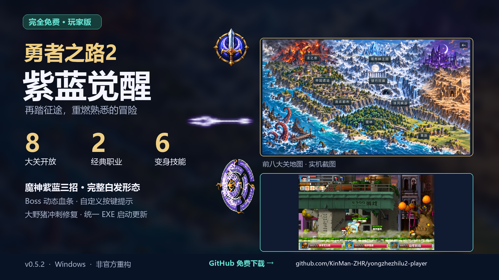

# 勇者之路 2 玩家版

**本游戏完全免费，游戏下载、游玩和版本更新均免费。**

[下载最新玩家版](https://github.com/KinMan-ZHR/yongzhezhilu2-player/releases/latest) · [观看新版宣传片](https://github.com/KinMan-ZHR/yongzhezhilu2-player/releases/download/v0.5.2/player-v0.5.2-trailer.mp4) · [赞助我吧](docs/sponsor.md)

本版统一怪物选招：先筛范围与冷却，再从可用招式中选择；按出招间隔检查，追踪移动保持流畅。冰雪女皇血量越低，攻击4权重越高；移动时有机会回血，治疗数字使用描边高光并上浮淡出。城镇药剂购买后的快捷栏数量即时刷新。

这是《勇者之路 2》的非官方重构改版，玩家包包含游戏运行文件与 [Ruffle](https://ruffle.rs/) 桌面运行器。

当前版本：[v0.5.12](https://github.com/KinMan-ZHR/yongzhezhilu2-player/releases/tag/v0.5.12)，开放前八大关。本版使用带专属图标的单一「开始游戏.exe」入口，启动更新窗口提供完全免费说明和可点击的 GitHub 玩家版页面。安装与更新自动清理旧游戏 BAT、兼容入口及 DirectX12 实验入口。

<!-- player-release-summary:start -->
v0.5.12 更新说明：

修复哥布林国王法师形态防御未减免的问题
<!-- player-release-summary:end -->

新版战斗内容包含魔神枪、锁链与魔轮转的统一紫蓝配色，保留金色闪电、白色高光与明暗层次，修复施法时的魔神外形与叠加特效；战神和魔神期间禁止切换职业，技能提示同步各自设置的实际快捷键，并包含本机怪物配置及大野猪连续冲刺修复。

变身后可使用 H／U／I：

| 职业 | H | U | I |
| --- | --- | --- | --- |
| 战士 | 魔光闪，2.5倍 | 鬼龙舞，1.8倍 | 皇龙霸气斩，18倍 |
| 法师 | 紫蓝魔贯枪，2.8倍 | 紫蓝锁链，三根刺各4倍 | 紫蓝魔轮转，0.5倍、耐久40 |

变身技能耗蓝沿用对应常态技能。战士变身防御提高60%，地面五段普攻提速25%；法师变身暴击率增加15个百分点。常态魔光闪倍率为1，常态与变身各有20帧无敌，约0.77秒，窗口内免疫普通伤害和反伤。战士常态上挑倍率为1.1。

树精攻击结束后正常恢复动作与身体显示。击杀经验按实际出场等级计算，普通、精英与Boss的经验倍率分别为1、3、8。动态Boss血条、世界地图名称与道路和既有战斗优化继续保留。

Boss套装的防具与首饰分别提供完整效果的40%，五件齐全合计100%。套装提示保留完整部件列表，分组用浅紫色、完整套装用暖金色，双档数值只点亮当前生效的一档。

1. 在 [Releases](https://github.com/KinMan-ZHR/yongzhezhilu2-player/releases/latest) 下载 windows-x64-setup.exe。
2. 双击安装包选择游戏目录。已有玩家请选择原游戏目录，以继续读取原存档。
3. 安装后从桌面快捷方式或「开始游戏.exe」游玩。统一使用 OpenGL。画质可在 Ruffle 菜单中调整。

未领取过补偿的存档角色自动领取 1000 金币；已领取角色保持现有金币。金额与领取标记一同保存，重复读档、重新启动和后续更新均不会重复发放。

每次启动时客户端检查 GitHub Release，下载、校验并安装新版本，再进入游戏。离线或更新失败时继续运行已安装版本。ZIP 附件继续供自动更新和手动覆盖原目录使用。游戏入口使用 EXE，更新组件随安装包保留。

Ruffle 桌面版当前缺少音频输出热切换恢复。使用蓝牙时先连接设备并设为 Windows 默认输出，Ruffle 输出设备选择 Default，然后完全关闭并重启游戏。

通关 5-5 或通过 7-5 出口可开放第八大关；第八关通关后保存并返回村庄。道路随对应出口完成而显现，旧存档保留已开放关卡，未知通关与路线记录随重玩补齐。影月城、古墓深处与海域留待后续开放。

请保留 Ruffle 授权文件。原游戏、角色、音乐和素材的权利归各权利人所有。

喜欢本次更新的话，欢迎[赞助我吧](docs/sponsor.md)，自愿支持后续维护。所有玩家使用相同的免费版本。
